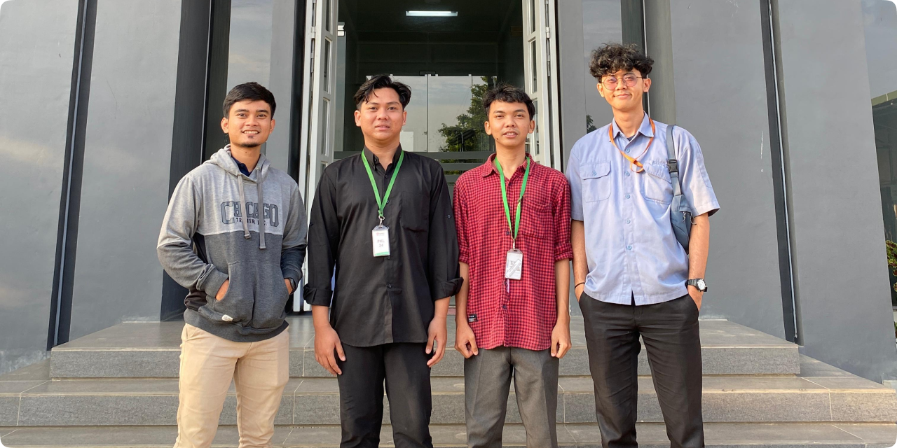
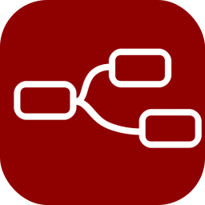

<h1 align="center">🚀Internship Resume - PT. Medion Farma Jaya</h1>

A comprehensive summary of my six-month internship at PT Medion Farma Jaya, focusing on the development and implementation of IoT solutions for Water Treatment Plant (WTP) management. This document highlights key projects, skills acquired, and contributions made during my role as a Software Engineering Intern.

# Docs

- [✨ Introduction](#introduction)
- [🏢 Company Overview](#company-overview)
- [🛠️ Task & Project Internship](#internship-tasks-and-projects)
- [🚀 Key Skills and Knowledge Gained](#👨‍💻-key-skills-and-knowledge-gained)
- [🌟 Contributions](#contributions)
- [📌 Certification](#🏆-certification-of-internship-completion)

# Introduction

[**PT Medion Farma Jaya**](company-profile.md), a leading company in the production of vaccines, medicines, and livestock equipment, has a strong commitment to environmental sustainability. To support this commitment, the company has integrated Internet of Things (IoT) technology into its Water Treatment Plant (WTP) management system. This system enables real-time monitoring and control of water quality, which is critical to both the operational needs of the company and its environmental goals.

### 📋 Internship Overview
During my six-month internship as a **Software Engineering Intern**, I focused on developing IoT applications to enhance WTP management efficiency. My responsibilities included configuring and implementing various technologies to collect, process, and visualize real-time data on water quality metrics.

> [!NOTE]  
> **Objective**  
> - **Academic Fulfillment**: Completing the required academic credits and deepening my knowledge in IoT technology, specifically within the Electronics Engineering field.
> - **Practical Application**: Gaining hands-on experience with IoT in a real industrial environment, and developing problem-solving skills essential to the engineering profession.

> [!NOTE]  
> **Key Responsibilities**  
> - **IoT System Implementation**: Configuring and deploying IoT devices and sensors to monitor WTP metrics such as pH, conductivity, and flow rates.
> - **Data Processing and Visualization**: Utilizing Node-RED and MySQL to manage, process, and visualize data in a user-friendly, real-time dashboard.
> - **Troubleshooting and Optimization**: Addressing technical challenges and optimizing system performance to ensure data accuracy and system reliability.

> [!NOTE]  
> **Skills and Technologies Gained**  
> - **Technical Skills**: IoT integration, Node-RED programming, SQL database management, and hands-on experience with ESP32 microcontrollers and sensor modules.
> - **Soft Skills**: Enhanced problem-solving capabilities, teamwork, and effective time management.

# Internship Tasks and Projects

| **Task** | **Project** | **Troubleshoot** |
|--------------------------------------------------------------------------------------------------|----------------------------------------------------------------------------------------------------|--------------------------------------------------------------------------------------------------|
| [Data Transmission from ESP32 to Node-RED via Broker](task/task1/data_transmission_esp32_to_nodered.md) | [Building Real-Time pH and Conductivity Report Dashboard with Export Feature]() | [Accessing localhost (xampp) from another computer over LAN network](Troubleshoot/accessing_localhost_xampp.md) |
| [Implementing SSL/TLS Authentication on MQTT with ESP32](task/task2/secure_data_transmission.md) | [Developing Custom Node on Node-RED for Value Conversion to pH and Conductivity](task/task3/) | [Host localhost is not allowed to connect to this MySQL server](Troubleshoot/mysql_host_access_error.md) | [Creating OEE Analysis Table Dashboard for Ion Exchanger]() | [Hall Effect Sensor Debouncing](Troubleshoot/hall_effect_debouncing.md) |
| [Logic Flow for Database Management of Hour Meter on Node-RED]() | [Creating Electrical Quality Analysis Table Dashboard]() | [MySql error `"Pool is closed"` in node-red](Troubleshoot/mysql_pool_closed_error_nodered.md) |
| [Calibration of pH and Conductivity on Distribution Machine]()                                       | -                                                                                                  | [Hall Effect Sensor Debouncing]() |
| [Developing Filtering Logic Flow on Node-RED for Demin Machine Data]()                               | -                                                                                                  | - |
| [Recording ESP32 MAC Addresses]()                                                                    | -                                                                                                  | - |

# 👨‍💻 Key Skills and Knowledge Gained

In this role, I engaged with a variety of technologies and platforms, gaining hands-on experience in IoT, database management, and data visualization. Here’s an overview of the key tools and skills I developed:

  
  
  
  
  
  

# Setup List

>[!NOTE]  
> To download each tool, visit its official website through the links provided below. Follow the instructions on the respective pages to install the software on your system.

|      **Tools**       |                         **Setup Installations**                          |
| :--------------: | :------------------------------------------------------------------: |
|  | [Node-RED↗](https://nodered.org/docs/getting-started/local) |
|  | [NodeJS↗](https://nodejs.org/en/download/package-manager/) |
|  | [Mysql↗](https://dev.mysql.com/doc/mysql-getting-started/en/) |
|  | [ArduinoIDE↗](https://www.arduino.cc/en/software) |
|  | [Ubuntu↗](https://ubuntu.com/download/desktop)|

## 🏆 Certification of Internship Completion
I have successfully completed a six-month internship at PT Medion Farma Jaya. You can view my certificate of completion by expanding the section below:

[**View PDF Version of Certificate**](./documents/surat-keterangan-PKL.pdf)

  
Click to view certificate

  
  

