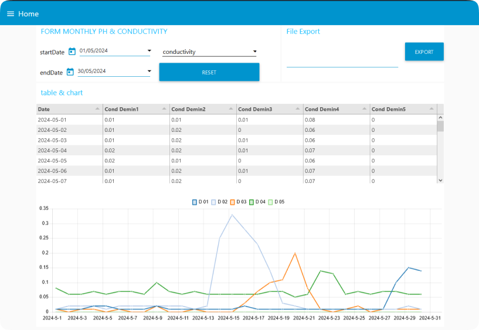
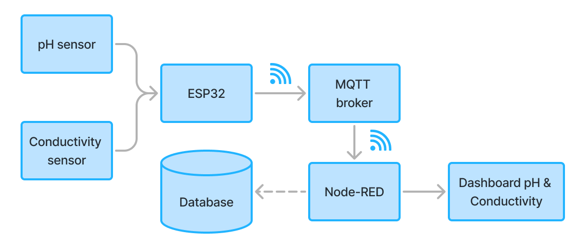
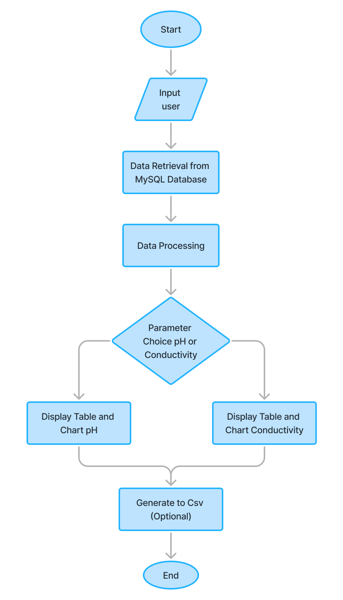
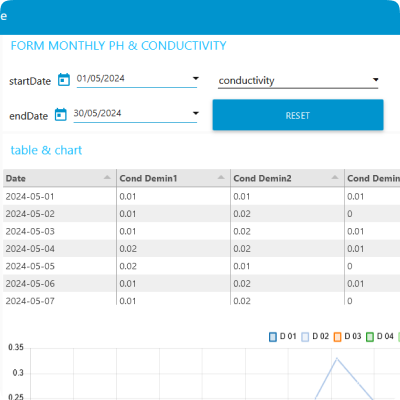
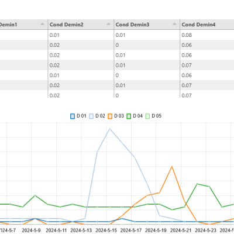
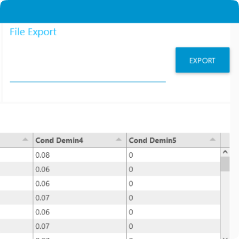

# Development of Real-Time pH and Conductivity Dashboard with Export Feature

## Overview

The project focuses on developing a real-time monitoring dashboard for pH and conductivity parameters at the Ion Exchanger unit in the Water Treatment Plant (WTP). Previously, data logging was done manually on paper, which was time-consuming and prone to human error. The new dashboard facilitates easy, accurate, and effective monitoring processes.

  

## Project Objectives

1. **Develop a dashboard** that displays real-time data for pH and conductivity.
2. **Simplify the monitoring process** by providing a feature to export data to CSV format.
3. **Reduce human errors** in data recording and enhance operational efficiency.
4. **Streamline the process** of generating pH and conductivity reports.

## System Block Diagram

  

This block diagram outlines the workflow of the system designed to monitor pH and conductivity levels in real-time at the WTP's Ion Exchanger.

### Workflow of the System

1. **pH and Conductivity Sensors** measure water pH and conductivity values.
2. **ESP32 Module** reads data from the sensors, converts it to digital format, and sends it to the server via Wi-Fi.
3. **Server** receives data from ESP32 and forwards it to the MQTT Broker.
4. **MQTT Broker** distributes the data to Node-RED.
5. **Node-RED** processes the data and stores it in the database.
6. **Dashboard** retrieves data from the database and displays it in real-time.

## Flowchart

  
Click to view flowchart

  
  

The flowchart illustrates the Node-RED dashboard workflow for monitoring pH and conductivity. The system starts by receiving user inputs for date and parameters (pH and conductivity). Data is then fetched from the MySQL database based on these inputs, and average values are calculated. The average data is displayed in tables and charts according to the selected parameter.

## Results

The development of the real-time pH and conductivity report dashboard with CSV export feature at the WTP has been successfully completed. The resulting dashboard is capable of displaying pH and conductivity data in real-time in an easily understandable table and chart format, tailored to the parameters selected by the user.

### **Achievements**

| Feature                   | Description                                                                                                                                                                                                                           | Documentations                                                                                                  |
|---------------------------|---------------------------------------------------------------------------------------------------------------------------------------------------------------------------------------------------------------------------------------|-------------------------------------------------------------------------------------------------------------|
| **Interactive Dashboard** | Users can select date ranges and parameters (pH or conductivity) to be displayed. Tables and charts adjust automatically to user selections, providing flexibility in data monitoring.                                              |                               |
| **Real-Time Data Display**| pH and conductivity data are displayed in real-time on the dashboard, allowing operators to immediately understand the current conditions of the Ion Exchanger.                                                                       |                                            |
| **CSV Export Feature**    | The dashboard includes a data export feature to CSV format, facilitating further data analysis or regular reporting by users.                                                                                                        |                                                    |

## Conclusion

The real-time monitoring dashboard not only enhances the efficiency and accuracy of data recording at the WTP but also supports proactive maintenance and operational decision-making.
