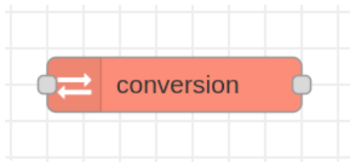
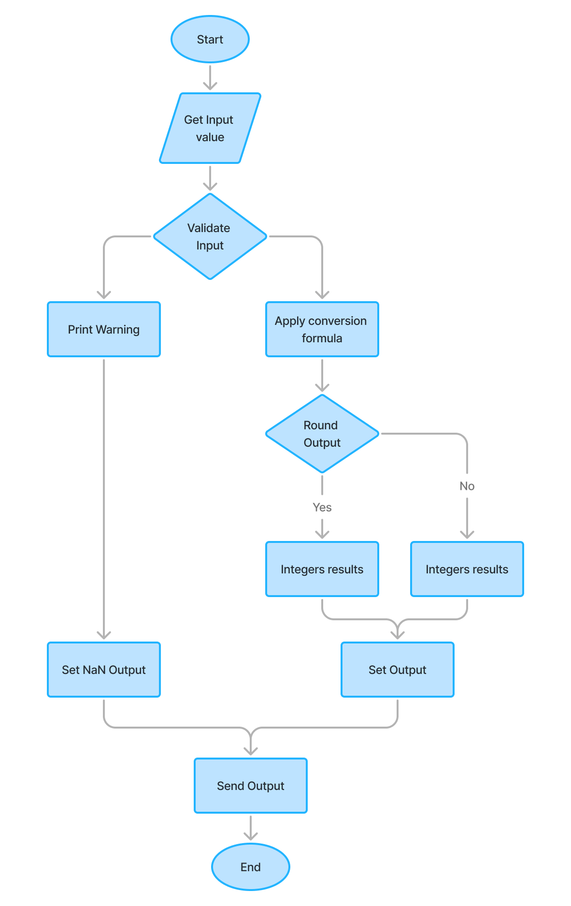
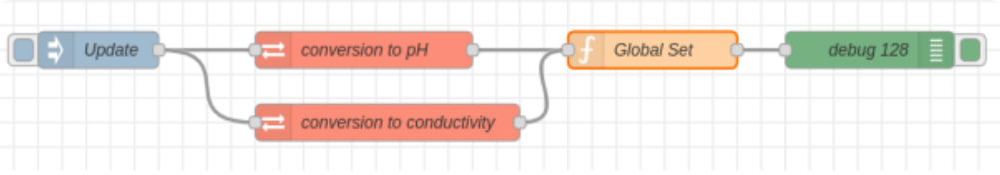
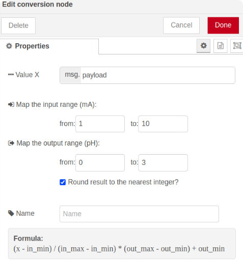

# Developing a Custom Node in Node-RED for Value Conversion to pH and Conductivity

## Overview

Monitoring pH and conductivity is crucial in managing water quality at Water Treatment Plants (WTP). However, sensors typically output values in electrical signals (e.g., milliamperes, mA), which need to be converted to more meaningful units such as pH or conductivity. This project focuses on developing a custom `Conversion` node in Node-RED that simplifies this process by providing an intuitive user interface for setting conversion parameters without the need for manual coding.


=

## Project Objectives

- **Develop a custom Node-RED node** that displays real-time data for pH and conductivity.
- **Facilitate easier monitoring** by allowing users to configure input and output ranges directly through the node's UI.
- **Enhance operational efficiency** by reducing manual coding and potential errors in the conversion process.

## Conversion Algorithm

The `Conversion` node will utilize the following formula to perform the conversion of sensor values:

```latex
\[
\left( \text{{out\_min}} + \left( \frac{{(x - \text{{in\_min}}) \times (\text{{out\_max}} - \text{{out\_min}})}}{{(\text{{in\_max}} - \text{{in\_min}})}} \right) \right)
\]
```
> [!NOTE]  
> To render this formula, you can use online LaTeX rendering services such as [QuickLaTeX](https://www.quicklatex.com/). Simply copy and paste the above LaTeX code into the QuickLaTeX input field and generate the image or PDF of the formula.

Where:
- `x` is the input value from the sensor (in mA).
- `in_min` and `in_max` are the minimum and maximum values of the input range (in mA).
- `output_min` and `output_max` are the minimum and maximum values of the output range (for pH or conductivity).


**Optional Feature**: Rounding the output to the nearest integer, which can be enabled or disabled via a checkbox in the node configuration.

## Flowchart of the Node

<details>
  <summary>Click to view flowchart</summary>
  
  
</details>


The flowchart illustrates the workflow of the `Conversion` custom node in Node-RED, which includes:

1. **Start**: Node activates upon receiving input data.

2. **Get Input Value**: Node retrieves the input value from the received message.
3. **Validate Input**: Checks if the input value is valid and if the node configuration is set correctly.
   - If invalid, outputs `NaN` and displays a warning message.
4. **Apply Conversion Formula**: If valid, applies the predetermined conversion formula.
5. **Round Output?**: Checks if rounding is enabled. If yes, rounds the output to the nearest integer.
6. **Set Output**: Assigns the converted (and possibly rounded) value as the output.
7. **Send Output**: Outputs the converted value to the next node in the Node-RED flow.
8. **End**: Completes data processing.

## Implementation

The custom `Conversion` node was developed using Node-RED as the primary platform and [Visual Studio Code](https://code.visualstudio.com/) (VSCode) as the development environment. This choice was made because Node-RED offers an intuitive graphical interface for custom node development, while VSCode provides advanced features like IntelliSense and debugging.

```
├── icons
├── bin
├── conversion.html
├── conversion.js
├── package-lock.json
└── package.json
```
Below is an example of the `package.json` for the custom Node-RED node, which defines the node's configuration within the Node-RED ecosystem:

```json
{
    "name" : "node-red-contrib-conversion",
    ...
    "node-red" : {
        "nodes": {
            "lower-case": "conversion.js"
        }
    }
}
```

**Main File Structure for Creating a Custom Node:**

1. **conversion.html**: Contains HTML code defining the node's User Interface (UI), including input elements for input and output ranges and a checkbox for rounding the output.

2. **conversion.js**: Contains the main logic of the node written in JavaScript. This file handles input reading, validation, application of the conversion formula, and output generation.

3. **conversion.json**: Contains node metadata such as name, description, category, and icon. It also defines configurable properties accessible through the UI.

## Results

The development of the `Conversion` custom node on Node-RED was successfully completed. The node has been tested and proven effective in converting raw sensor values to appropriate pH or conductivity values.

**Key Outcomes:**

1. **Functional Custom Node**:

   
   - The `conversion` node functions as expected, accepting raw sensor input and producing correctly converted pH or conductivity values.

2. **Intuitive User Interface**:

   
   - The node features a user-friendly interface that allows users to easily set conversion parameters and enable/disable rounding.

This custom node significantly simplifies the data conversion process in Node-RED, enhancing both the accuracy and efficiency of monitoring water quality parameters in WTP.

