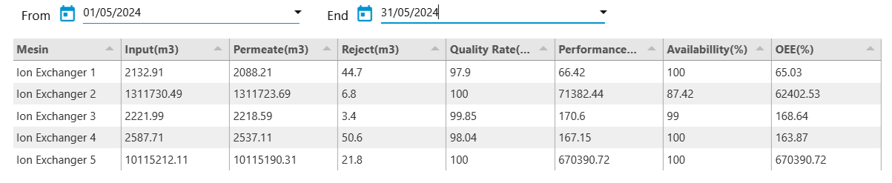

# Developing an OEE Analysis Dashboard Table for Ion Exchanger

## Overview

To improve the efficiency and effectiveness of the Water Treatment Plant (WTP) operations, monitoring the performance of the Ion Exchanger machine is essential. This project focuses on developing an `OEE` ([Overall Equipment Effectiveness](https://accurate.id/marketing-manajemen/oee-adalah/)) dashboard table, which not only displays `OEE` metrics but also key information such as input volume, permeate, reject, etc., from the water demineralization process using the Ion Exchanger.

## Project Objectives

1. **Monitor Machine Performance**:
   - The dashboard provides real-time visualizations of OEE metrics such as **`Availability`**, **`Performance`**, and **`Quality`**. This allows operators to oversee the operational effectiveness of the Ion Exchanger in real-time, helping to ensure the machine operates at optimal capacity and minimizes downtime.

2. **Analyze Process Efficiency**:
   - By displaying data on input volume, permeate, and reject, the dashboard table helps operators assess the efficiency of the water demineralization process. This information is crucial to evaluate the quality of treated water and identify potential losses in the process.

## Dashboard Table

The OEE table was created in Node-RED using UI elements such as **ui dashboard**, **ui table**, and **ui datepicker** to filter data according to selected date ranges. Here is a breakdown of the data in the table:

### 1. Input (m3)
   - **Description**: The volume of water entering the Ion Exchanger over a specific period. This input is essential for calculating machine performance and efficiency.

### 2. Permeate (m3)
   - **Description**: The volume of water successfully processed to meet the required quality standard.
   - **Formula**: 
     $$ \text{Permeate} = \text{Input} - \text{Reject} $$

### 3. Reject (m3)
   - **Description**: The volume of water rejected or not successfully processed by the Ion Exchanger, indicating inefficiencies or issues in the process.

### 4. Availability (%)
   - **Description**: The percentage of time the machine was available during the analysis period, calculated as the operational time compared to the planned time.
   - **Formula**:
    
     $$ \text{Availability} = \frac{(\text{Total Days} - \text{Downtime})}{\text{Total Days}} \times 100\% $$

   - **Note**: An Availability Rate of 100% means the machine was always available and operating as planned.

### 5. Performance (%)
   - **Description**: Measures the production speed of the Ion Exchanger against the ideal or standard speed. A performance rate close to 100% indicates the machine is operating near its ideal capacity.

   - **Formula**:
     $$ \text{Performance} = \frac{\text{Permeate}}{\text{Target}} \times 100\% $$

   - **Target Calculation**:
     $$ \text{Target} = \text{Hour Meter} \times \text{Standard Flow Rate} $$

   - **Standard Flow Rates for Ion Exchangers**:
     | Machine         | Standard Flow Rate (LPM) |
     |-----------------|--------------------------|
     | Ion Exchanger 1 | 30                       |
     | Ion Exchanger 2 | 16                       |
     | Ion Exchanger 3 | 12                       |
     | Ion Exchanger 4 | 15                       |
     | Ion Exchanger 5 | 15                       |

### 6. Quality (%)
   - **Description**: Measures the percentage of water produced by the Ion Exchanger that meets the quality standards. A high Quality Rate (close to 100%) indicates that most of the water produced meets the quality standards.
   - **Formula**:
     $$ \text{Quality} = \frac{\text{Permeate}}{\text{Input}} \times 100\% $$

### 7. OEE (%)
   - **Description**: Combines the three key aspects of machine operation - Availability, Performance, and Quality - to provide a comprehensive view of the efficiency and effectiveness of the Ion Exchanger in producing quality water.
   - **Formula**:
     $$ \text{OEE} = \text{Availability} \times \text{Performance} \times \text{Quality} $$

## Project Results

The OEE dashboard table developed in Node-RED allows for real-time monitoring and analysis of key metrics. Here are some of the achievements from the project:

1. **Interactive Dashboard**:
   - Operators can select date ranges and view OEE metrics, providing flexibility in monitoring.

2. **Real-Time Data Display**:
   - Displays current conditions of the Ion Exchanger, facilitating early detection of anomalies and enabling quick corrective actions.

3. **In-depth Efficiency Analysis**:
   - Data on permeate, reject, and input help assess water demineralization efficiency.

4. **CSV Export**:
   - The dashboard includes a CSV export feature, making it easy to analyze data offline or create regular reports.

### Summary Table Structure

The table displays all critical metrics in an organized manner, making it simple to understand machine performance and process efficiency.

---

This project highlights the integration of real-time data monitoring and analysis through a structured and efficient dashboard, providing critical insights into the operational efficiency of the Ion Exchanger in the Water Treatment Plant.

