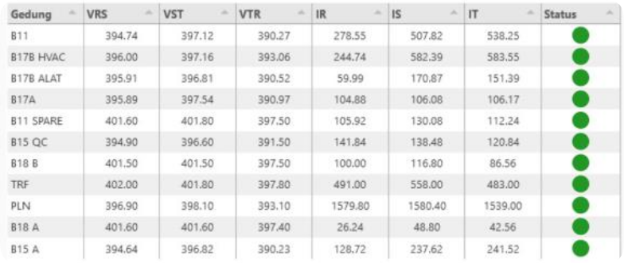

# **Electricity Quality Dashboard**

## **Overview**

This dashboard is designed to monitor the electricity quality in real-time across several buildings at **PT Medion Farma Jaya**. By displaying key parameters and status indicators, the dashboard helps in identifying potential issues and ensuring a stable electricity supply.

## **Project Objectives**

The main objective of this project is to develop a dashboard that displays electricity quality parameters in real-time across multiple buildings at **PT Medion Farma Jaya**. The dashboard also simplifies monitoring with a status indicator for each building.

## **Results**

### **Electricity Quality Table for Each Building**

  

The resulting dashboard displays the following parameters:

| **Parameter** | **Description**                                       |
|---------------|-------------------------------------------------------|
| **`VRS`**       | Average supply voltage (Volt)                         |
| **`VST`**       | Highest supply voltage (Volt)                         |
| **`VTR`**       | Lowest supply voltage (Volt)                          |
| **`IR`**        | Average current on R cable (Ampere)                   |
| **`IS`**        | Average current on S cable (Ampere)                   |
| **`IT`**        | Average current on T cable (Ampere)                   |

Each building has a **status indicator** showing whether the electricity quality is in good condition (**`green`**) or not (**`red`**).

## **Explanation of Parameters**

- **`VRS` (Average Supply Voltage)**: The average voltage supplied to the building. This parameter helps in assessing if the supplied voltage meets the standard operational requirements.
- **`VST` (Highest Supply Voltage)**: The peak voltage recorded within the monitoring period. Monitoring this value ensures that voltage spikes do not exceed safe thresholds.
- **`VTR` (Lowest Supply Voltage)**: The lowest voltage recorded, ensuring that dips do not fall below operational standards.
- **`IR` (Average Current on R Cable)**: The average current flowing through the R phase cable. Ensures balanced current distribution across phases.
- **`IS` (Average Current on S Cable)**: The average current on the S phase cable.
- **`IT` (Average Current on T Cable)**: The average current on the T phase cable.

## **Dashboard Features**

- **Real-Time Monitoring**: Displays current and voltage parameters in real-time, updating continuously for immediate insights.
- **Status Indicator**: Each building's status indicator shows a **green** color if electricity quality is stable and a **red** color if quality is unstable or outside safe thresholds.

## **Usage**

The dashboard can be accessed by relevant personnel in the facilities management department, allowing them to:

1. **Monitor Key Parameters**: Track voltage and current levels across multiple buildings to ensure a balanced and stable electricity supply.
2. **Identify Issues**: Quickly identify potential issues, such as voltage spikes or dips, and respond to them proactively to prevent downtime.
3. **Ensure Stability**: Monitor the overall stability of electricity supply with visual indicators, ensuring that any potential disruptions are immediately visible.