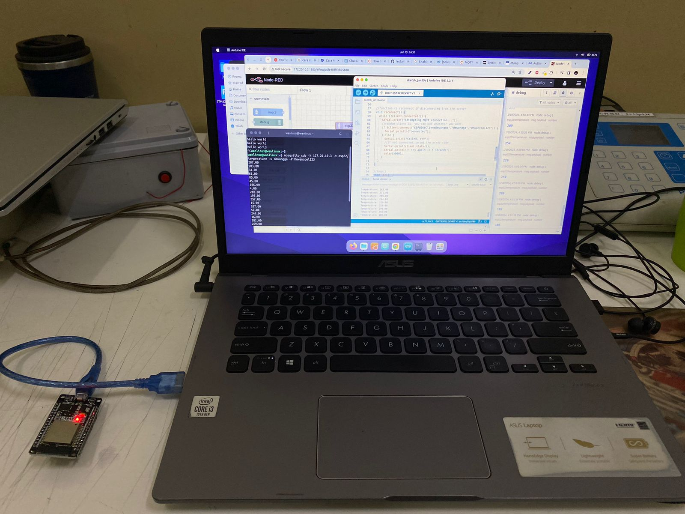

# Data Transmission from ESP32 to Node-RED via Broker

This guide provides step-by-step instructions to set up a data transmission system where the ESP32 microcontroller communicates with a Node-RED dashboard via an MQTT broker and stores data in a MySQL database.

---

## Step 1: Setting Up Node-RED

1. **Installation**:
   - Follow the official installation guide available at [Setup Instructions](https://nodered.org/docs/getting-started/local).
   - Install Node-RED globally on your system by running the following command in your terminal:

     ```bash
     npm install -g --unsafe-perm node-red
     ```

   - After installation, launch Node-RED by running:

     ```bash
     node-red
     ```

   - Open your browser and navigate to `http://localhost:1880` to access the Node-RED interface.

2. **Install Required Nodes**:
   - To integrate with the database, install the MySQL nodes in Node-RED:
     - Go to **Menu > Manage palette > Install** and search for `node-red-node-mysql`.
     - Alternatively, you can install it by running the following command in the Node-RED user directory (typically `~/.node-red`):

       ```bash
       cd ~/.node-red
       npm install node-red-node-mysql
       ```

---

## Step 2: Connecting to the MySQL Database

1. **Database Setup**:
   - Ensure you have a MySQL server running. If you haven’t installed it, follow the [MySQL Setup Instructions](../../setup/README_SETUP.md).
   - Create a new database (e.g., `iot_data`) where the ESP32 data will be stored.

     ```sql
     CREATE DATABASE iot_data;
     ```

2. **Configure MySQL Node in Node-RED**:
   - In the Node-RED interface, add a **MySQL node** from the **palette**.
   - Double-click the MySQL node to configure it with your database details:
     - **Host**: `127.0.0.1`
     - **Port**: `3306`
     - **User**: `root`
     - **Password**: `123` (or your MySQL root password)
     - **Database**: `iot_data`

   - **Example Query**:
     - To test the database connection, you can run a simple SQL query (e.g., `SELECT * FROM your_table_name`) using the MySQL node.

---

## Step 3: Integrating ESP32 as a Subscriber

1. **Prepare ESP32 with MQTT Firmware**:
   - Flash your ESP32 with firmware supporting MQTT (if not done already). You can follow the instructions in the [ESP32 documentation](https://docs.espressif.com/projects/esp-idf/en/latest/esp32/get-started/) for firmware setup.
   
2. **Write MQTT Subscriber Script for ESP32**:
   - Use Arduino IDE or any other ESP32-compatible environment to program the ESP32 as an MQTT client.
   - Install the **PubSubClient** library for MQTT communication if using the Arduino IDE.

     ```cpp
     #include <WiFi.h>
     #include <PubSubClient.h>

     // WiFi and MQTT broker configuration
     const char* ssid = "your_SSID";
     const char* password = "your_PASSWORD";
     const char* mqtt_server = "broker_address";

     WiFiClient espClient;
     PubSubClient client(espClient);

     void setup() {
         Serial.begin(115200);
         WiFi.begin(ssid, password);

         // Wait for connection
         while (WiFi.status() != WL_CONNECTED) {
             delay(1000);
             Serial.println("Connecting to WiFi...");
         }

         client.setServer(mqtt_server, 1883);
     }

     void reconnect() {
         while (!client.connected()) {
             if (client.connect("ESP32Client")) {
                 client.subscribe("sensor/data");
             } else {
                 delay(5000);
             }
         }
     }

     void loop() {
         if (!client.connected()) {
             reconnect();
         }
         client.loop();
     }
     ```

   - **Explanation**:
     - This script connects the ESP32 to a Wi-Fi network and subscribes to the topic `sensor/data` on the MQTT broker.

3. **Deploy ESP32**:
   - Ensure the ESP32 is powered and connected to the same network as the MQTT broker.

---

## Step 4: Configuring Node-RED Flows

1. **Create a New Flow**:
   - Open the Node-RED interface (`http://localhost:1880`) and create a new flow to handle the MQTT messages and database storage.

2. **Add MQTT Input Node**:
   - Drag an **MQTT Input node** onto the workspace.
   - Configure the MQTT Input node:
     - **Server**: Enter your MQTT broker address.
     - **Topic**: `sensor/data` (or the topic your ESP32 is publishing to).
   - This node will receive data from the ESP32 whenever it publishes to the specified topic.

3. **Add MySQL Node**:
   - Connect the output of the **MQTT Input node** to a **MySQL node**.
   - Set up the MySQL node with an SQL query to insert incoming data into your database. Example query:

     ```sql
     INSERT INTO sensor_data (timestamp, value) VALUES (NOW(), payload);
     ```

   - Ensure that your `sensor_data` table is set up correctly in the database to receive this data:

     ```sql
     CREATE TABLE sensor_data (
         id INT AUTO_INCREMENT PRIMARY KEY,
         timestamp DATETIME,
         value VARCHAR(255)
     );
     ```

4. **Complete the Flow**:
   - Connect all nodes to create a seamless flow from MQTT input to database storage.
   - Deploy the flow by clicking the **Deploy** button in the top-right corner of the Node-RED interface.

---

## Step 5: Testing and Verification

1. **Test MQTT Communication**:
   - Publish test messages from ESP32 to verify that Node-RED receives the data. Use the Node-RED debug node to monitor incoming messages.

2. **Verify Database Entries**:
   - Check your MySQL database (`iot_data`) to ensure the data from ESP32 is correctly recorded in the `sensor_data` table.

3. **Troubleshooting**:
   - If data is not being recorded, verify:
     - ESP32 connection to the MQTT broker.
     - Node-RED flow configuration.
     - Database connection settings and permissions.

---

This completes the setup for data transmission from ESP32 to Node-RED via MQTT broker, with data stored in MySQL for further analysis.

<details>
  <summary>Click to view documentation</summary>
  
  
</details>
