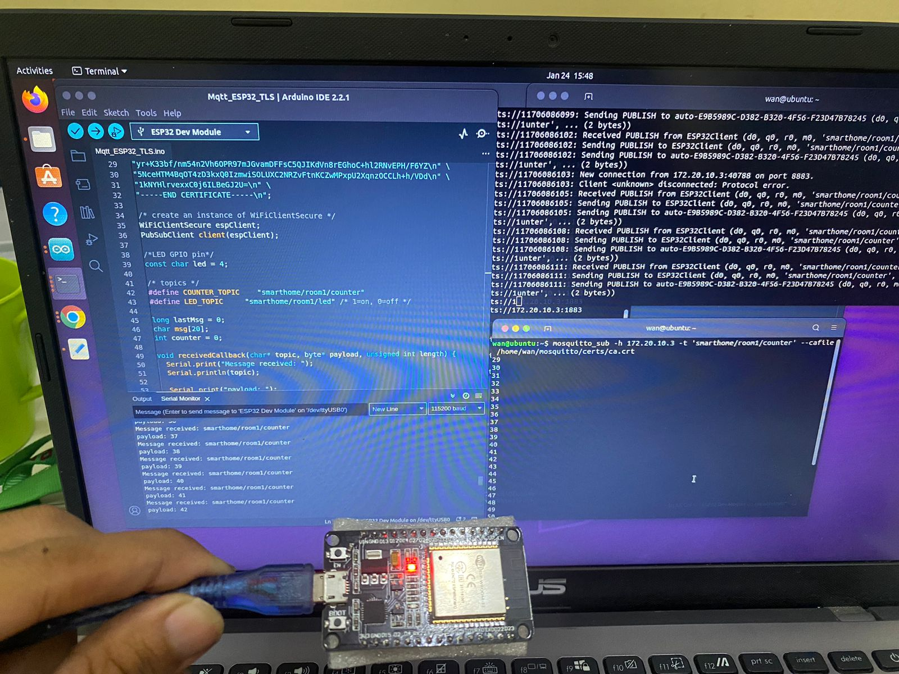

# Implementing SSL/TLS Authentication on MQTT with ESP32

This tutorial covers how to set up SSL/TLS on MQTT for secure communication between ESP32 and Node-RED. SSL/TLS (Secure Sockets Layer/Transport Layer Security) is a cryptographic protocol that encrypts data, ensuring that only authorized parties can read and understand it. This setup will involve configuring SSL/TLS on both the ESP32 and Node-RED, using a CA (Certificate Authority) certificate.

### Requirements
- ESP32
- Node-RED with MQTT broker (e.g., [Mosquitto](https://github.com/eclipse-mosquitto/mosquitto))
- CA Certificate (for SSL/TLS)
---

## Step 1: Understanding SSL/TLS and MQTT

`SSL/TLS` provides encryption to secure the communication between the ESP32 (client) and the MQTT broker (server). By implementing SSL/TLS, the data transmitted over the network is encrypted, reducing the risk of eavesdropping and tampering.

To enable SSL/TLS, both the ESP32 and MQTT broker must trust the same CA certificate. This certificate authenticates the connection, ensuring that both parties (publisher and subscriber) are authorized.

---

## Step 2: Setting Up the CA Certificate

1. **Generate CA Certificate**:
   - Use `OpenSSL` or a similar tool to generate a CA certificate. Run the following commands in your terminal
        ```bash
        openssl genrsa -out ca.key 2048
        openssl req -x509 -new -nodes -key ca.key -sha256 -days 365 -out ca.crt
        ```
   - This generates two files:
     - `ca.key`: The private key for the CA.
     - `ca.crt`: The public certificate for the CA. which will be used on the ESP32 and MQTT broker 
2. **Generate Server Certificates for MQTT Broker**:
   - Generate a private key and a certificate signing request (CSR) for the MQTT broker:
        ```bash
        openssl genrsa -out server.key 2048
        openssl req -new -key server.key -out server.csr
        ```
   - Sign the server certificate with the CA certificate:
        ```bash
        openssl x509 -req -in server.csr -CA ca.crt -CAkey ca.key -CAcreateserial -out server.crt -days 365 -sha256
        ```
   - Now you should have:
     - `server.key`: The private key for the MQTT broker.
     - `server.crt`: The signed certificate for the MQTT broker.
---

## Step 3: Configuring the MQTT Broker (Mosquitto) with SSL/TLS

1. **Set up Mosquitto MQTT Broker**:
   - Install Mosquitto if you haven’t already:
        ```bash
        sudo apt update
        sudo apt install mosquitto mosquitto-clients
        ```
2. **Add the following configuration to enable SSL/TLS**:
   - Open the Mosquitto configuration file:
        ```bash
        sudo nano /etc/mosquitto/conf.d/ssl.conf
        ```
   - Install the **PubSubClient** library for MQTT communication if using the Arduino IDE.

        ```conf
        listener 8883
        cafile /path/to/ca.crt
        certfile /path/to/server.crt
        keyfile /path/to/server.key
        require_certificate true
        ```

   - Make sure to replace `/path/to/` with the actual path where you saved `ca.crt`, `server.crt`, and `server.key`.

3. **Restart Mosquitto**:
   - Restart the Mosquitto service to apply the changes:
        ```bash
        sudo systemctl restart mosquitto
        ```
---

## Step 4: Configuring SSL/TLS on ESP32

1. **Add CA Certificate to ESP32**:
   - Add the `ca.crt` certificate to your ESP32 code to allow it to verify the server’s certificate.

2. **Programming the ESP32**:
   - Use the following code to connect ESP32 to the MQTT broker with SSL/TLS authentication. This example uses the PubSubClient library. 
        ```cpp
        #include <WiFi.h>
        #include <PubSubClient.h>
        #include <WiFiClientSecure.h>

        // WiFi credentials
        const char* ssid = "your_SSID";
        const char* password = "your_PASSWORD";

        // MQTT broker details
        const char* mqtt_server = "broker_address";
        const int mqtt_port = 8883;

        // CA certificate
        const char* ca_cert = R"EOF(
        -----BEGIN CERTIFICATE-----
        MIID...
        -----END CERTIFICATE-----
        )EOF";

        WiFiClientSecure espClient;
        PubSubClient client(espClient);

        void setup() {
            Serial.begin(115200);
            WiFi.begin(ssid, password);

            // Wait for WiFi connection
            while (WiFi.status() != WL_CONNECTED) {
                delay(1000);
                Serial.println("Connecting to WiFi...");
            }

            espClient.setCACert(ca_cert);  // Set CA certificate for secure connection
            client.setServer(mqtt_server, mqtt_port);

            // Connect to MQTT
            if (client.connect("ESP32Client")) {
                Serial.println("Connected to MQTT broker securely!");
            } else {
                Serial.println("Failed to connect to MQTT broker");
            }
        }

        void loop() {
            if (!client.connected()) {
                client.connect("ESP32Client");
            }
            client.loop();
        }
        ```
     - Explanation:
       - `WiFiClientSecure` is used to enable SSL/TLS.
       - The `setCACert()` function sets the CA certificate for the secure connection.
2. **Upload Code to ESP32**:
   - Compile and upload the code to your ESP32 using the Arduino IDE or [PlatformIO](https://platformio.org/).
---

## Step 5: Configuring Node-RED to Use SSL/TLS

1. **Add MQTT Node in Node-RED**:
   - Open Node-RED (`http://localhost:1880`) and add an MQTT input/output node from the palette.

2. **Configure MQTT Node for SSL/TLS**:
   - Double-click the MQTT node to configure it.
   - Set the Server to the broker’s IP address or hostname and Port to `8883` (the SSL/TLS port).
   - In the Security section, enable Use TLS and select your CA certificate to ensure a secure connection.

3. **Testing**:
   - Deploy the flow and ensure Node-RED successfully connects to the MQTT broker using SSL/TLS.
   - Add a Debug node to verify that data is securely received from the ESP32.
---

## Step 6: Testing and Verification

1. **Verify Connection**:

   - Confirm that the ESP32 successfully connects to the MQTT broker using the secure port (`8883`).
   - Check the Mosquitto logs or Node-RED debug panel to verify secure data transmission.

1. **Monitor Data Transmission**:

   - Ensure that data transmitted between ESP32 and Node-RED is encrypted, preventing unauthorized access or tampering.

1. **Troubleshoot Common Issues**:

   - Certificate Errors: Verify that the CA certificate on ESP32 matches the broker's CA certificate.
   - Connection Issues: Double-check WiFi and MQTT broker settings, including port and server address.

This completes the secure data transmission setup from ESP32 to Node-RED via MQTT.
<details>
  <summary>Click to view documentation</summary>
  
  
</details>
