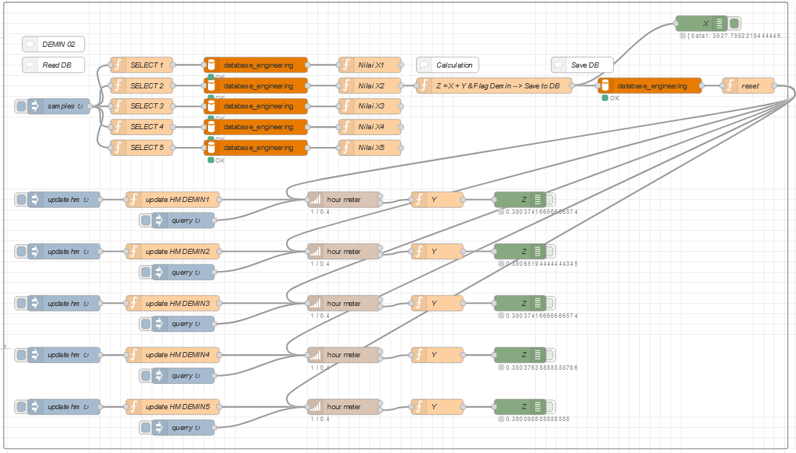

# Logic Flow for Database Management of Hour Meter on Node-RED

## Overview

This guides you through designing a logic flow in Node-RED for managing the hour meter database at each water filtering point: Demineralized Water, Machine Water Distribution, Clean Water Distribution, and Purified Water. The objective of this logic flow is to calculate the accumulated operational time of each filtering machine by utilizing rotation data from a magnetic sensor attached to the water meter.

## Objectives
- Automatically retrieve the latest rotation data from the sensor every hour.
- Convert rotation data into hour meter values.
- Update the stored hour meter value in the database.
- Monitor the operational time of each machine effectively.

## Prerequisites
- Node-RED installed and running.
- A working MySQL database to store hour meter data.
- A magnetic sensor set up to measure the rotation of the water meter.

## Flow Logic Overview

The following flow diagram illustrates the logic for managing the hour meter database in Node-RED. It outlines how data is retrieved, calculated, and saved to the database.

 <!-- Replace with the actual path to your uploaded image -->

### Flow Description

1. **Data Retrieval**: 
   - The flow starts by reading data from the magnetic sensor at specified intervals (e.g., every hour).
   - Nodes labeled `SELECT 1`, `SELECT 2`, etc., are responsible for fetching the latest rotation values from the database.

2. **Calculation**:
   - The flow uses a calculation node to compute the new hour meter value based on the retrieved rotation data.
   - This calculation involves adding the new values derived from the sensor data to the existing hour meter values stored in the database.

3. **Update Database**:
   - After calculation, the updated hour meter values are sent to corresponding update nodes (e.g., `update HM DEMIN1`, `update HM DEMIN2`, etc.) that modify the relevant records in the database.
   - Each update query ensures that the operational hours are recorded correctly for each machine.

4. **Resetting Values**:
   - Finally, after updating the database, the flow may include nodes to reset the sensor values or any temporary variables used during calculations.

## Conclusion
By following this tutorial, you can effectively manage the hour meter database for water filtering machines using Node-RED. This system enables easy monitoring of the operational time of each machine, helping to ensure efficient management and maintenance.