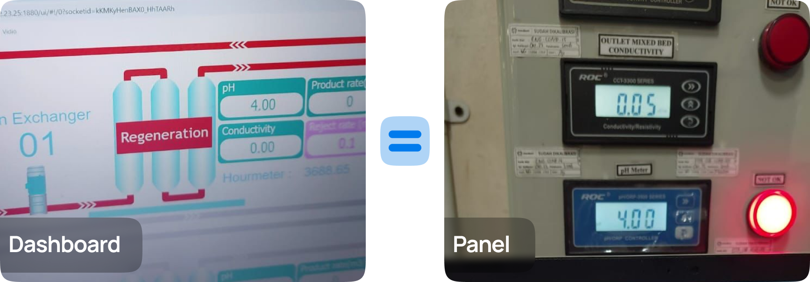
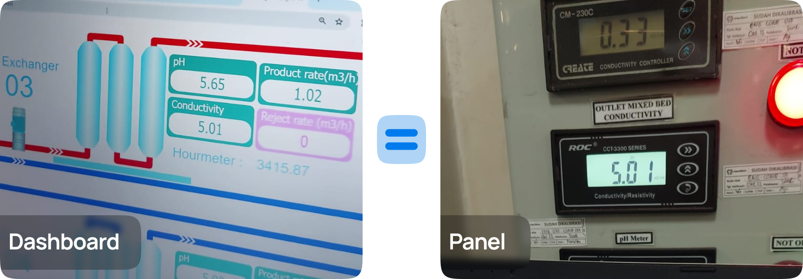

# Calibration of pH and Conductivity in Water Distribution Machines

## Overview

Calibrating pH and conductivity sensors is an **essential procedure** for maintaining the **accuracy** and **reliability** of measurements for water quality parameters produced by the Water Treatment Plant (WTP). During the practical work experience, I performed pH and conductivity calibration on the demineralized water and purified water distribution machines and updated these values on the Node-RED dashboard. The calibration process was conducted twice: first on the machines for purified water and then on the reverse osmosis machine.

## pH Calibration Protocol

  

### Materials Needed
- Clean pH sensor free from contamination
- pH buffer solutions (**`4.01`**, **`7.01`**, and **`9.18`**)
- Deionized water for cleaning

### Calibration Steps
1. **Prepare the Sensor**: 
   - Clean the pH sensor with deionized water to remove any contaminants.

2. **First Calibration Step**: 
   - Dip the pH sensor into the pH **`7.01`** buffer solution.
   - Read the pH meter and adjust the instrument to display a value of pH **`7`**.

3. **Second Calibration Step**: 
   - Rinse the sensor with deionized water to avoid cross-contamination.
   - Dip the sensor into the pH **`4`** buffer solution.
   - Wait for the reading to stabilize, then adjust the pH meter to the corresponding value.

4. **Documentation**: 
   - Record the calibration results.
   - Update the calibration values on the WTP dashboard accordingly.

## Conductivity Calibration Protocol

  

### Materials Needed
- Clean conductivity sensor free from contamination
- Standard conductivity solutions

### Calibration Steps
1. **Prepare the Sensor**: 
   - Clean the conductivity sensor with deionized water to eliminate contaminants.

2. **Calibration Procedure**:
   - Dip the conductivity sensor into the **standard solution**.
   - Wait for the reading to stabilize.

3. **Adjustment**:
   - Adjust the conductivity meter to match the value of the **standard solution**.

4. **Documentation**:
   - Record the calibration results.
   - Update the calibration values on the dashboard to ensure they align with the machine readings.

## Conclusion

Following the calibration protocols for both pH and conductivity ensures that the sensors provide **accurate readings**, which are crucial for monitoring water quality in the distribution machines. Regular calibration helps in maintaining the **operational efficiency** of the water treatment processes and ensures compliance with **quality standards**.