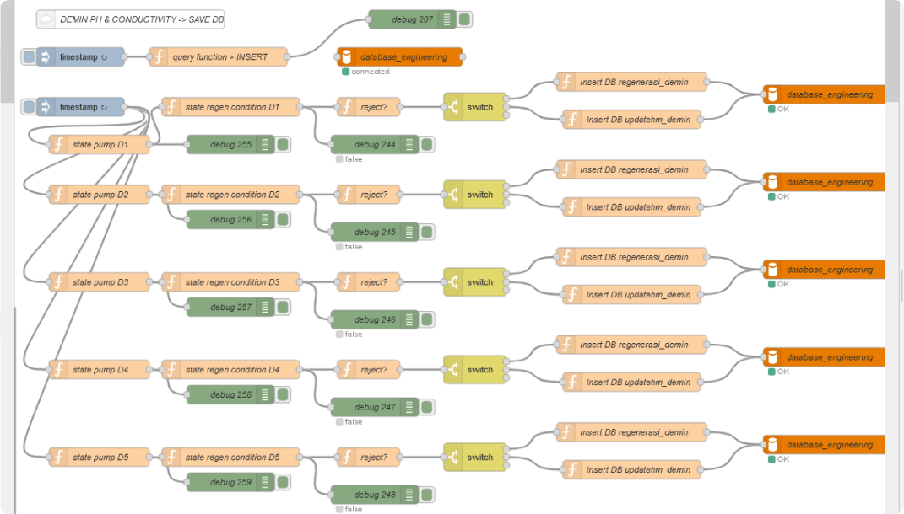
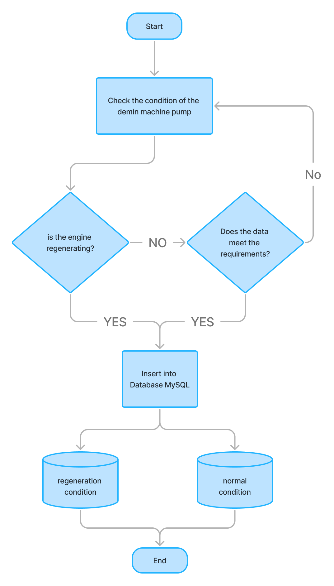

# Developing Logic Flow in Node-RED for Filtering Data from Demineralized Water Machine

## Overview

The development and improvement of the logic flow in Node-RED are crucial for ensuring the accuracy of data entered into the database from the demineralized water machine. The previous logic had flaws that caused data not to be stored correctly. The new revision aims to ensure that during the regeneration process, all regeneration data, including rejected data, will be entered into the database. However, when the machine is operating normally, only valid data will be accepted, while rejected data will not be recorded in the database.

### Data Validation Criteria
- **pH Data**: Accepted if within the range **`5 < pH < 7`**; otherwise, it is considered rejected data.
- **Conductivity Data**: Accepted if within the range **`0.0 ≤ conductivity < 0.8`**; otherwise, it is considered rejected data.

There are two database tables used for storing this data: one for regeneration data and one for normal operating data.

  

## Flow Logic Components

The following sections describe the components of the Node-RED flow that manages the data storage process from the demineralized machine to the database.

### Components Description

- **Inject Node**: 
   - This node is used to specify when data is sent. The interval set on this inject node is every **5 minutes** for data entry.

- **State Pump Node**: 
   - This node monitors the condition of pumps Demin 1 through Demin 5. Each pump has a state checked to determine if it is **on** or **off**. If the pump is on, the process continues to the next node; if it is off, no action is taken.

- **State Regen Condition**: 
   - This function determines whether the machine is in a regeneration state. The output from this function dictates the next steps in the data flow.

- **Reject Function**: 
   - This function has multiple conditions. If the machine is in regeneration, it sends a payload to the topic **`insertRegen`**, which directs the data to the appropriate storage path in the database. If the machine is operating normally and the data meets the criteria, it sends the data to the topic **`insertMain`**. However, if the data does not meet the criteria or is rejected, it sends the payload to the topic **`rejectData`**.

- **Switch Node**: 
   - This node differentiates the flow based on the topic from the previous node. If the topic is **`insertRegen`**, it stores the data in the regeneration database table. If the topic is **`insertMain`**, it stores it in the normal operating database table. If the topic is **`rejectData`**, no action is taken, and the data is ignored.

- **MySQL Node**: 
   - This node is configured to connect to the MySQL database for data storage.

## Flowchart Overview

The flowchart illustrates the logic flow for processing data from the demineralized machine in the WTP using Node-RED. This visual representation simplifies the understanding of the flow logic that has been developed.

  
Click to view flowchart

  
  

## Data Storage and Reporting

Validated data is then stored in the MySQL database, accessible through the localhost PHPMyAdmin. The output data generated from processing in the Node-RED flow consists of pH and conductivity data, which are used for monthly reporting that must be input regularly.

## Conclusion

The improved logic flow in Node-RED ensures that accurate data from the demineralized water machine is consistently stored in the database. This process not only helps in maintaining data integrity but also facilitates effective monitoring and reporting of water quality parameters.

