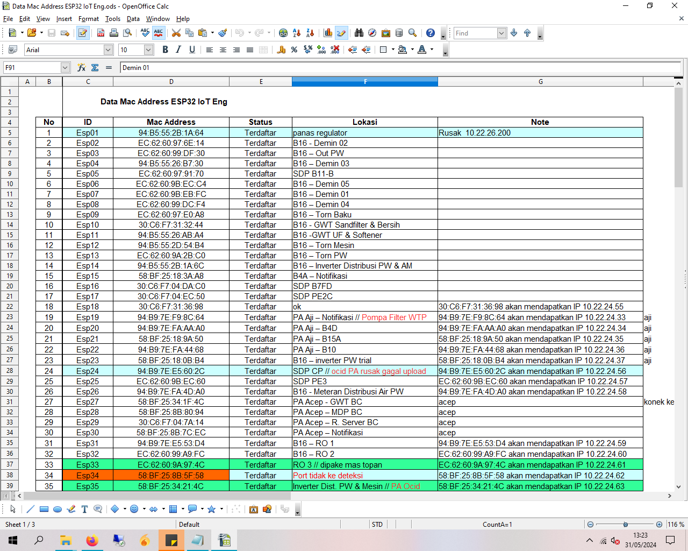

# Registering MAC Addresses of ESP32 

## Overview

ESP32 devices are utilized for Internet of Things (IoT) applications across various operational areas in the Water Treatment Plant (WTP). To manage this network effectively, each ESP32 device is uniquely identified by its Media Access Control ``(MAC) address``. These addresses are recorded in a spreadsheet to facilitate the identification and tracking of each device's location and status.

## Procedure for Recording ESP32 MAC Addresses

### Steps to Record the MAC Address:

1. **Programming ESP32**:
   - Each ESP32 module is programmed with an Arduino IDE script that outputs the device's WiFi module MAC address.

2. **Reading the MAC Address**:
   - Once the program is uploaded, the ESP32 is connected to a computer via USB. The Serial Monitor in Arduino IDE is then used to display the MAC address.

3. **Recording the MAC Address**:
   - The displayed MAC address is recorded into a spreadsheet on OpenOffice. This table includes columns to categorize and identify each ESP32 device effectively.

4. **Numbering ESP32 Devices**:
   - After recording, each ESP32 is assigned a unique sequential number based on the order of registration. This number aids in easy reference and tracking within the system.
   
<details>
  <summary>Click to view documentation</summary>
  
  
</details>

## Arduino IDE Program for Retrieving MAC Address

Below is a simple Arduino IDE program that reads and displays the MAC address of an ESP32's WiFi module.

```cpp
#include <WiFi.h>
#include <esp_wifi.h>

void readMacAddress(){
  uint8_t baseMac[6];
  esp_err_t ret = esp_wifi_get_mac(WIFI_IF_STA, baseMac);
  if (ret == ESP_OK) {
    Serial.printf("%02x:%02x:%02x:%02x:%02x:%02x\n",
                  baseMac[0], baseMac[1], baseMac[2],
                  baseMac[3], baseMac[4], baseMac[5]);
  } else {
    Serial.println("Failed to read MAC address");
  }
}

void setup(){
  Serial.begin(115200);

  WiFi.mode(WIFI_STA);
  WiFi.STA.begin();

  Serial.print("[DEFAULT] ESP32 Board MAC Address: ");
  readMacAddress();
}
 
void loop(){

}
```
